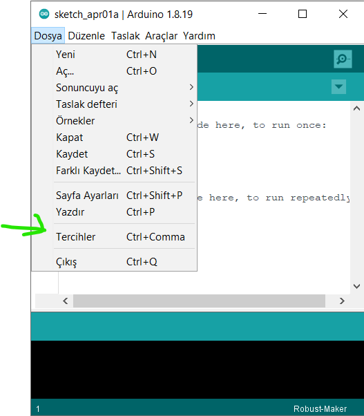
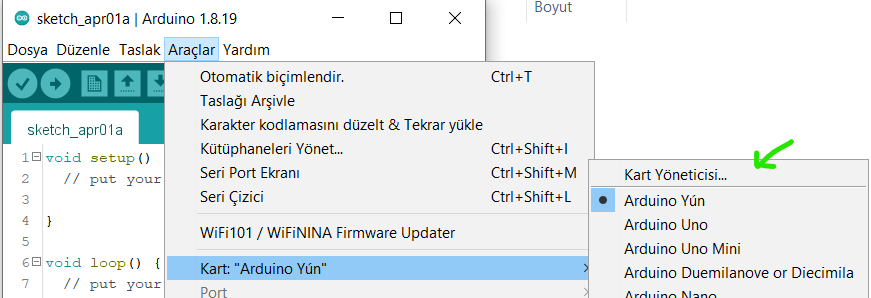

# 

# Türkçe

- [Arduino IDE için Robust Maker kart paketi](#arduino-ide-için-robust-maker-kart-paketi)
- [Supported Boards & Features](#supported-boards--features)
- [Paket Kurulum Adımları](#paket-kurulum-adımları)
- [VCOM Driver Installation Steps (Optional for M032BT)](#vcom-driver-installation-steps-optional-for-m032bt)
- [Compatible Versions of Arduino IDE](#compatible-versions-of-arduino-ide)
- [Disclaimer](#disclaimer)
- [Important Notice](#important-notice)

# Arduino IDE için Robust Maker kart paketi
Bu depo, Robust Maker kart için ide tanımlayıcıyı içerir.

# Supported Boards & Features

| NuMaker Kartları | Zengin Çevresel Birimler |USB Port Desteği | Debugger |
| -------------- | ---------------- |---------| ----------------------------------------------- |
| **NUC240 Pro** | ✔️                |  ✔  | ✔️                                               |
| **NUC240**     | ✔️                |  ❌  | ❌                                               |

# Paket Kurulum Adımları
1.  https://www.arduino.cc/en/Main/Software Arduio IDE indirilip Kurulur.
2. Arduino yazılımı çift tıkla çalıştırılır, ardından **Dosya->Terçihler** seçilir.

3. Aşağıdaki URL'yi 'Ek Pano Yönetici URL'leri' giriş alanına yapıştırın:

`https://raw.githubusercontent.com/SalihPalamut/Robust-Maker/main/package_robust_index.json`

4. Under **Araçlar->Kart->Kart Yöneticisi**, 

`Robust Maker` aranır, **Kur** işlemi seçilir.

5. Artık Robust Maker'ı seçebilir ve Arduino IDE'de kullanabilirsiniz.

# VCOM Driver Installation Steps (Optional for M032BT)
The Virtual COM (VCOM) interface requires a VCOM driver to be installed on PC first. 
The driver "Nu-Link_USB_Driver 1.x.exe" can be found at: http://www.SoSmart.com/opencms/resource-download.jsp?tp_GUID=SW0520150729202535

1. Execute "Nu-Link_USB_Driver 1.x.exe" after the USB cable is un-plugged.
2. Follow the steps of installation wizard to select setup language and installation location.
3. Plug in USB cable after driver installation complete.
4. Connect the Robust Maker with PC using a USB cable. If the driver is successfully installed, the Windows shall find a new device and then automatically find the correct driver. A virtual COM port named "SoSmart Virtual Com Port" can be found in "Device Manager".

# Compatible Versions of Arduino IDE
* 1.8.15
* 1.8.10
* 1.8.8
* 1.8.5

# Disclaimer
The Software is furnished "AS IS", without warranty as to performance or results, and
the entire risk as to performance or results is assumed by YOU. SoSmart disclaims all
warranties, express, implied or otherwise, with regard to the Software, its use, or
operation, including without limitation any and all warranties of merchantability, fitness
for a particular purpose, and non-infringement of intellectual property rights.

# Important Notice
SoSmart Products are neither intended nor warranted for usage in systems or equipment,
any malfunction or failure of which may cause loss of human life, bodily injury or severe
property damage. Such applications are deemed, "Insecure Usage".

Insecure usage includes, but is not limited to: equipment for surgical implementation,
atomic energy control instruments, airplane or spaceship instruments, the control or
operation of dynamic, brake or safety systems designed for vehicular use, traffic signal
instruments, all types of safety devices, and other applications intended to support or
sustain life.

All Insecure Usage shall be made at customer's risk, and in the event that third parties
lay claims to SoSmart as a result of customer's Insecure Usage, customer shall indemnify
the damages and liabilities thus incurred by SoSmart.

Please note that all data and specifications are subject to change without notice. All the
trademarks of products and companies mentioned in this datasheet belong to their respective
owners.

**Kopya (C) 2022 SoSmart Technology Corp. All rights reserved**

# English

- [Robust Maker board package for Arduino IDE](#numaker-uno-board-package-for-arduino-ide)
- [Supported Boards & Features](#supported-boards--features)
- [Board Package Installation Steps](#board-package-installation-steps)
- [VCOM Driver Installation Steps (Optional for M032BT)](#vcom-driver-installation-steps-optional-for-m032bt)
- [Compatible Versions of Arduino IDE](#compatible-versions-of-arduino-ide)
- [Disclaimer](#disclaimer)
- [Important Notice](#important-notice)

# Robust Maker board package for Arduino IDE
This repository contains the package descriptor for Robust Maker boards

# Supported Boards & Features

| NuMaker Boards | Rich peripherals | Debugger |
| -------------- | ---------------- | ----------------------------------------------- |
| **NUC240 Pro** | ✔️                | ✔️                                               |
| **NUC240**     | ✔️                | ❌                                               |

# Board Package Installation Steps
1. Download and Install Arduino IDE from https://www.arduino.cc/en/Main/Software
2. Double-click arduino.exe, and then go to **File->Preferences**

3. Paste following URL to 'Additional Boards Manager URLs' input field: 

`https://raw.githubusercontent.com/SalihPalamut/Robust-Maker/main/package_robust_index.json`

4. Under **Tools->Board->Boards Manger**, 

search `Robust Maker`, click **Install**

5. You can now select Robust Maker and install it in Arduino IDE.

# VCOM Driver Installation Steps (Optional for M032BT)
The Virtual COM (VCOM) interface requires a VCOM driver to be installed on PC first. 
The driver "Nu-Link_USB_Driver 1.x.exe" can be found at: http://www.SoSmart.com/opencms/resource-download.jsp?tp_GUID=SW0520150729202535

1. Execute "Nu-Link_USB_Driver 1.x.exe" after the USB cable is un-plugged.
2. Follow the steps of installation wizard to select setup language and installation location.
3. Plug in USB cable after driver installation complete.
4. Connect the Robust Maker with PC using a USB cable. If the driver is successfully installed, the Windows shall find a new device and then automatically find the correct driver. A virtual COM port named "SoSmart Virtual Com Port" can be found in "Device Manager".

# Compatible Versions of Arduino IDE
* 1.8.15
* 1.8.10
* 1.8.8
* 1.8.5

# Disclaimer
The Software is furnished "AS IS", without warranty as to performance or results, and
the entire risk as to performance or results is assumed by YOU. SoSmart disclaims all
warranties, express, implied or otherwise, with regard to the Software, its use, or
operation, including without limitation any and all warranties of merchantability, fitness
for a particular purpose, and non-infringement of intellectual property rights.

# Important Notice
SoSmart Products are neither intended nor warranted for usage in systems or equipment,
any malfunction or failure of which may cause loss of human life, bodily injury or severe
property damage. Such applications are deemed, "Insecure Usage".

Insecure usage includes, but is not limited to: equipment for surgical implementation,
atomic energy control instruments, airplane or spaceship instruments, the control or
operation of dynamic, brake or safety systems designed for vehicular use, traffic signal
instruments, all types of safety devices, and other applications intended to support or
sustain life.

All Insecure Usage shall be made at customer's risk, and in the event that third parties
lay claims to SoSmart as a result of customer's Insecure Usage, customer shall indemnify
the damages and liabilities thus incurred by SoSmart.

Please note that all data and specifications are subject to change without notice. All the
trademarks of products and companies mentioned in this datasheet belong to their respective
owners.

**Copyright (C) 2022 SoSmart Technology Corp. All rights reserved**
